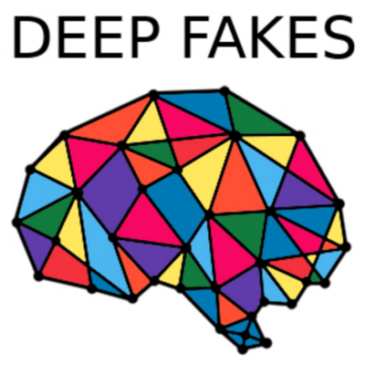

# Easy to use GUI for DeepFakes

**Notice:**  This is a project based on DeepFakes.

---

# deepfakes_gui
Faceswap is a tool that uses deep learning to recognize and swap faces in pictures and videos.

## Overview
The projects aimes to help people without development skills to use DeepFakes
  - **Extract** pictures from videos (video of input and output people)
  - **Extract** faces from video frames
  - **Train** a model on your photos
  - **Replace** : faces inside video

## What you need
  - **A computer** with or without **CUDA** (way faster with)
  - **ffmpeg** (`apt-get install ffmpeg` on linux)

